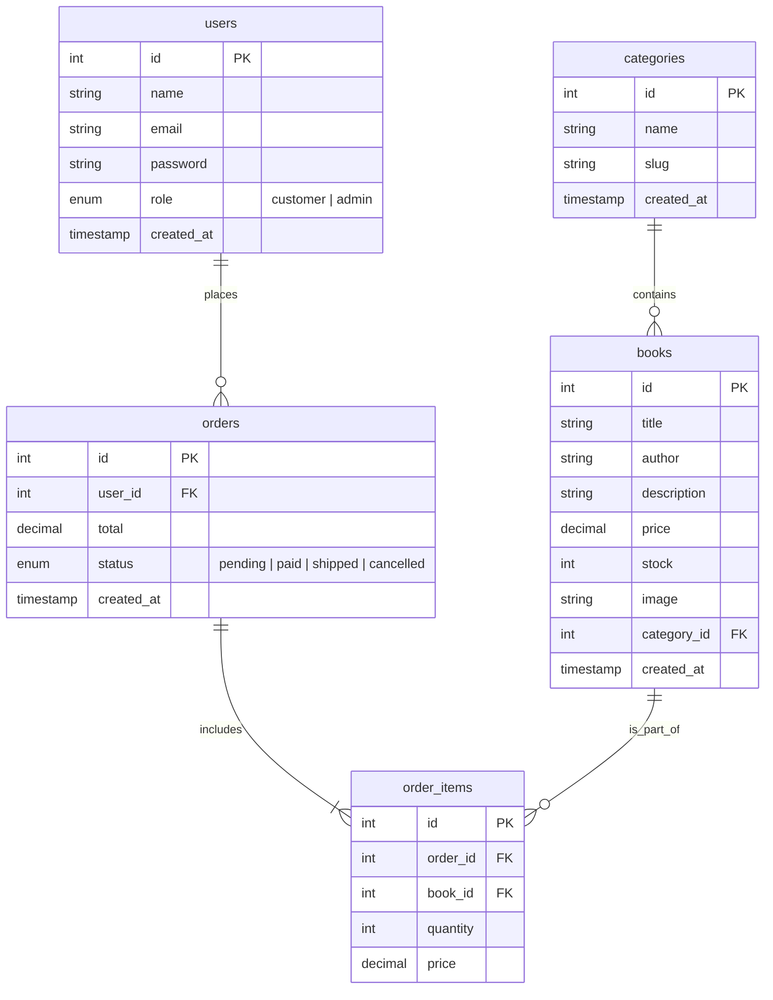
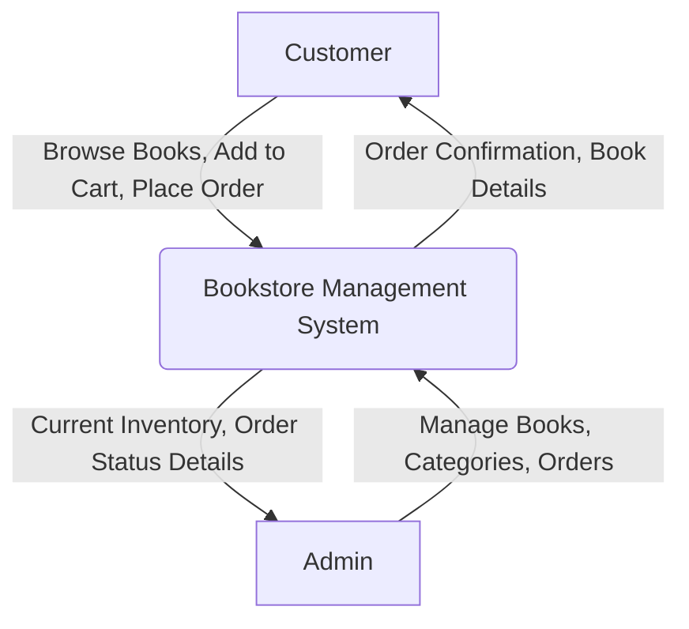
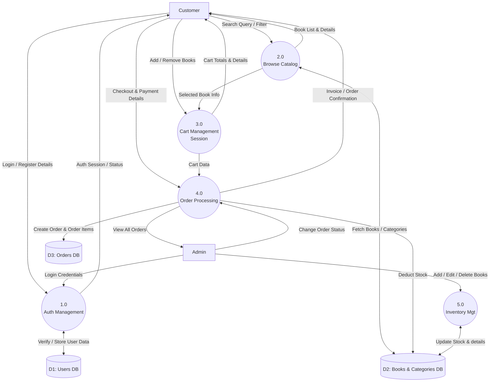

# Bookstore Management System Diagrams

This document contains the Entity-Relationship (ER) diagram and Data Flow Diagrams (DFD) for the Bookstore Management System. You can view these diagrams in any Markdown viewer that supports Mermaid.js, or by using extensions in VS Code/GitHub.

## 1. Entity-Relationship (ER) Diagram

This diagram shows the database structure and the relationships between the tables (`users`, `categories`, `books`, `orders`, and `order_items`).

---

## 2. Context Diagram (Level 0 DFD)

The Context Diagram gives a high-level overview of the entire system as a single process, interacting with external entities (Customer and Admin).

---

## 3. Level 1 Data Flow Diagram (DFD)

The Level 1 DFD breaks down the main system into detailed sub-processes like Authentication, Catalog browsing, Cart management, Order processing, and Inventory management.

